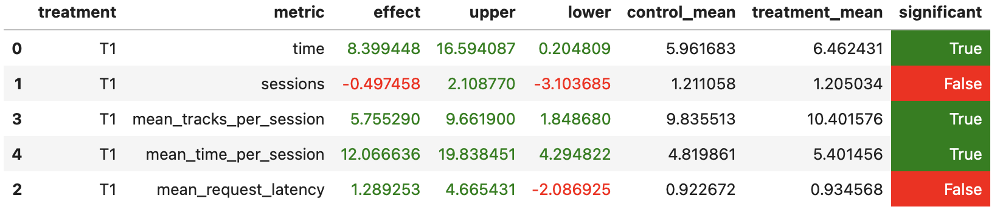

## Отчет

### Основа
Возьму за базовую версию лучший рекоммендер с семинаров - Contextual.

### Проблема Contextual
Проблема заключается в том, Contextual всегда рекомендует на основе предыдущего трека.
Может получиться так что если пользователю не понравится порекомендованная нами песня 
и он её пропустит, мы всё равно будем рекомендовать похожие треки.

### Основная идея

Одно из улучшений, которое можно внести, это создание словаря long_listen, хранящего треки, понравившиеся пользователю.
Треки попадут в этот словарь, если время их прослушивания превышает определенное пороговое значение, например, 70%.
И вместо того, чтобы рекомендовать трек на основе предыдущего, буду рекомендовать трек на основе случайного из словаря long_listen.
Вместо использования случайного выбора(Random) в качестве fallback-рекомендации, я предпочел использовать выбор на основе похожих пользователей(Indexed). 
Это связано с тем, что если пользователю не понравилось ни одно из прослушанных вариантов, кажется разумным рекомендовать 
ему что-то, что нравится другим пользователям с похожими вкусами.

### Результаты A/B эксперимента

Данные получены благодаря симуляции
```
python sim/run.py --episodes 1000 --config config/env.yml multi --processes 2
```

Эксперимент проведен согласно [jupiter notebook](jupyter/Week1Seminar.ipynb) из 1 семинара. 
В результате реализованный [рекомендер](botify/botify/recommenders/contextual_custom.py) 
оказался лучше [Contextual](botify/botify/recommenders/contextual.py) по ряду параметров, 
в том числе по требуемому **mean_time_per_session**. 
Эта метрика увеличилась стат.значимо на 12% по сравнению с базовым рекомендером Contextual.



### Инструкции

Программа запускается, тестируется и используется согласно описанию на семинарах, а также в ранее выложенных Readmes: [botify](botify/README.md), [simulator](sim/README.md)

Каждый пункт рассматривается из корня репозитория

1. Запустить botify в docker: 
```
cd botify
docker-compose up -d --build
```
2. Запустить sim у себя на машине
```
cd sim
python -m venv env
pip install -r requirements.txt
export PYTHONPATH=${PYTHONPATH}:.
python sim/run.py --episodes 1000 --config config/env.yml multi --processes 2
```